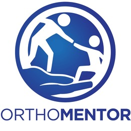

# Qompass
Cost-Conscious Gen-AI Microsystems. We offer four cardinal services to help you navigate the deep waters of deep tech. 

- **N**autilus: NIST-compliant Security Solutions 
- **E**quator: Empowering AI education 
- **S**ojourn: AI Sandbox Studios
- **W**averunner: AI Meshed-Microservers

## In partnership with OrthoMentor

## Licensing
This repository and all applications within it are dual-licensed under the terms of the [Qompass Commercial Distribution Agreement (CDA)](LICENSE) and [GNU Affero General Public License v3.0 (AGPL-3.0)](LICENSE-AGPL) licenses.
